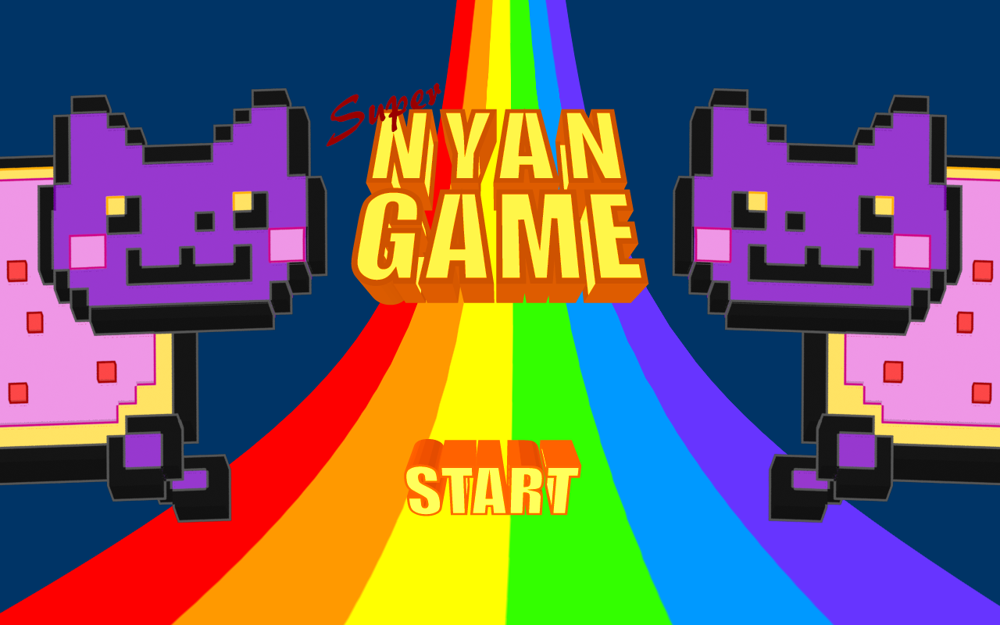

<div align="center">

# 🌈 Super NyanGame — Revival

### A 2014 ActionScript / Starling university game, brought back to life for the modern web.


<br>



<br>

**Collect stars. Dodge enemies. Build speed. Hit Turbo. Try not to get vaporized.**

[Watch original gameplay](https://www.youtube.com/watch?v=2LAvAmsCCuY)

</div>

---

## Play locally

The TypeScript/PixiJS port is ready for local review. Final acceptance of the visual and gameplay match is pending.

```sh
npm ci
npm run dev
```

Open http://127.0.0.1:5173/super-nyangame-2026/. Move the pointer vertically, collect stars, avoid enemies, and click the result star to return. Audio starts after a gesture. See [DEVELOPMENT.md](DEVELOPMENT.md) for builds, verification and the optional development checks.

---

## About this project

**Super NyanGame** began as a university project more than a decade ago.

The original game was created by **Óscar Gil (Karrion)** and **Mike Fieldins (s1vh)** for a Web Game Design course, using the technology stack of its time: **ActionScript 3, Adobe Flash and Starling**.

It was a small arcade game built around a deliberately simple loop: control Nyan Cat, collect as many stars as possible, avoid procedurally spawned enemies, and survive long enough to reach **Turbo Mode**.

The faster the run became, the more demanding the game became.

Getting hit reset the player's speed. Surviving increased it progressively. At the limit, Turbo Mode changed the rules: more stars appeared, they gravitated toward the player, and the next collision became less punishing.

It was never intended to be a huge commercial game.

It was a student project made to learn, experiment, and ship something playable.

And it worked.

---

## Why revive it?

Flash is gone from the modern web.

Starling belongs to a very different development era.

The original game can still be studied as source code, and old recordings still show what it looked like in motion, but asking a portfolio visitor to run a Flash game in 2026 would defeat the purpose of showing it.

So this repository is not a remake created from scratch to imitate an old project.

It is a **continuation**.

The goal is to preserve the original game's identity while replacing its obsolete runtime with a lightweight, browser-native stack that can be opened and played instantly.

The project is also intended to make one thing visible:

> **how the same developer approaches the same game after more than a decade of technical growth.**

---

## The modernization

The first milestone is intentionally conservative:

> **Port the original game 1:1 before adding anything new.**

That means preserving the original:

- gameplay loop;
- player movement;
- procedural enemy spawning;
- speed progression;
- Turbo Mode;
- scoring;
- collision behavior;
- animations;
- audio cues;
- menu flow;
- overall visual identity.

Only after parity is reached will the revival begin to expand beyond the original university submission.

### Legacy stack

```text
ActionScript 3
Adobe Flash
Starling
TweenLite
Flash audio APIs
Monolithic texture atlases
SWF deployment
```

### Revival stack

```text
TypeScript
PixiJS 8
WebGL
Vite
HTML + CSS
Web Audio API
Modular asynchronous asset bundles
GitHub Pages
```

No browser plugins.

No launcher.

No mandatory backend.

Just open the page and play.

---

## Why PixiJS?

The original game was built with **Starling**, so PixiJS is a natural modern successor for this particular port.

Many concepts map cleanly between both architectures:

| Starling / Flash | Modern revival |
| --- | --- |
| `Sprite` / display container | `PIXI.Container` |
| `Image` | `PIXI.Sprite` |
| `MovieClip` | `PIXI.AnimatedSprite` |
| `TextureAtlas` | `PIXI.Spritesheet` |
| `ENTER_FRAME` / juggler | `PIXI.Ticker` |
| touch events | pointer events |
| bitmap fonts | Pixi bitmap textures with source-compatible glyph layout |
| Flash audio | Web Audio API |
| filters / GPU effects | Pixi filters + GLSL shaders |

The objective is not to force the game into a heavyweight engine.

PixiJS provides the rendering layer the project needs while allowing the original gameplay architecture to remain recognizable during the migration.

---

## Asset pipeline

The original build uses a large shared sprite sheet containing much of the game artwork.

The parity build preserves both original PNG atlases byte for byte and converts their metadata for PixiJS. Physical splitting into **smaller logical asset bundles** is deferred until parity is accepted (SN-BL-001).

The goal is not to create one network request per sprite.

After parity, assets may be grouped by responsibility:

```text
assets/
├── ui/
├── player/
├── enemies/
├── effects/
├── backgrounds/
└── audio/
```

This keeps texture batching efficient while making the game easier to extend.

A future enemy should be addable without rebuilding an unrelated mega-atlas.

The implemented loading strategy is:

```text
HTML shell
    ↓
minimal JavaScript
    ↓
boot / menu assets
    ↓
interactive title screen
    ↓
core game preloads in the background
    ↓
PLAY
    ↓
game starts with little or no additional waiting
```

---

## Static-first by design

The revival is intended to remain a **static web game**.

The production build should consist only of:

- HTML;
- JavaScript;
- CSS;
- images;
- audio;
- static metadata.

The preferred deployment target is **GitHub Pages**, built automatically through GitHub Actions.

```text
repository
   ↓
GitHub Actions
   ↓
Vite build
   ↓
dist/
   ↓
GitHub Pages
```

There is deliberately no application server in the initial architecture.

---

## Future leaderboard

A public leaderboard is planned for a later phase, but it must remain optional.

The current preferred design is intentionally small:

```text
GitHub Pages
      │
      │ HTTPS
      ▼
Google Apps Script
      │
      ▼
Google Sheets
```

Gameplay must continue to work even if the leaderboard is unavailable.

The frontend will never contain privileged credentials for direct write access to a private Sheet.

---

## Historical preservation

This project matters partly because of where it came from.

The original university version should remain available as a historical artifact rather than being silently overwritten by the modern port.

The intended project history is:

```text
2014
│
├── original ActionScript / Starling development
├── original university submission
└── historical version frozen
        │
        │
        │  more than a decade later
        │
        ▼
2026
│
├── browser modernization begins
├── TypeScript / PixiJS port
├── 1:1 parity release
└── future development continues
```

The active repository is `s1vh/super-nyangame-2026`. The historical upstream `s1vh-old-university-projects/VJ1217-GAME` is read-only. One principle is fixed:

**the historical work and its authorship must remain visible.**

---

## Authors

### Original project

**Óscar Gil (Karrion)**  
**Mike Fieldins (s1vh)**

The original repository describes the game as a two-person university project.

### Modern revival

**Mike Fieldins**

The 2026 work focuses first on preservation and technical modernization, then on future development after parity with the original build has been achieved.

---

## Current status

| Area | Status |
| --- | --- |
| Original ActionScript source | ✅ Preserved |
| Original art and audio | ✅ Preserved |
| Original gameplay footage | ✅ Available |
| Modern architecture | ✅ Defined |
| Product requirements | ✅ Defined |
| TypeScript / PixiJS bootstrap | ✅ Implemented |
| Asset migration | ✅ Original PNGs preserved; metadata converted |
| 1:1 gameplay port | ✅ Playable locally; user parity acceptance pending |
| GitHub Pages release | ⏳ Planned |
| New content | 🔒 After parity |
| Leaderboard | 🔒 Future phase |

---

## Revival roadmap

### Phase 0 — Preserve the original

- identify the final historical source state;
- preserve original authorship and attribution;
- keep the university submission reproducible where practical;
- finalize the public repository/fork strategy.

### Phase 1 — Bootstrap the modern project

- TypeScript;
- PixiJS 8;
- Vite;
- WebGL renderer;
- static GitHub Pages-compatible build.

### Phase 2 — Modernize the asset pipeline

- preserve original PNG atlases; split them after parity acceptance;
- migrate animation metadata;
- preserve visual fidelity;
- preload gameplay assets asynchronously.

### Phase 3 — Port the game

- player;
- enemies;
- stars;
- spawning;
- scoring;
- speed progression;
- Turbo Mode;
- collision;
- game over;
- audio.

### Phase 4 — Verify parity

- compare against original gameplay footage;
- correct timing differences;
- verify animation speed;
- verify collision feel;
- test current browsers.

### Phase 5 — Publish

- GitHub Actions;
- GitHub Pages;
- portfolio presentation;
- historical documentation.

### Phase 6 — Continue what we left unfinished

Only after the original game has been faithfully restored:

- new enemies;
- new visual effects;
- custom shaders;
- technical stats overlay;
- additional gameplay systems;
- leaderboard;
- further content and balancing.

---

## Design principle

This revival follows one simple rule:

> **Preserve first. Port second. Improve third.**

Modernization should make the project easier to run, understand and extend without rewriting its history.

---

## Documentation

Project documentation is maintained in English.

The technical and product decisions for the revival are described in the project PRD:

**[`PRD.md`](PRD.md)**

Implementation and operation: [`MIGRATION.md`](MIGRATION.md), [`PARITY.md`](PARITY.md), [`DEVELOPMENT.md`](DEVELOPMENT.md), and [`VALIDATION.md`](VALIDATION.md).

---

## Legacy source

The original source tree contains the ActionScript implementation, historical art files, sprite animation frames, audio, texture atlases, Flash build artifacts and the original project documentation.

Those files are intentionally valuable.

They are not just migration input — they are part of the project's history.

---

## License and asset notice

The original repository states that the university project was released under a **Creative Commons Attribution / Non-Commercial / Share-Alike** license.

Before the modern revival is released publicly, the licensing and attribution of:

- the original project;
- third-party libraries;
- music and sound assets;
- character-related material;
- newly written 2026 code;

will be reviewed and documented explicitly.

Until that review is complete, this README should not be interpreted as changing the licensing terms of the historical project.

---

<div align="center">

### 🌈 From Flash to the modern web — without pretending the past never happened.

**Super NyanGame Revival**

</div>
